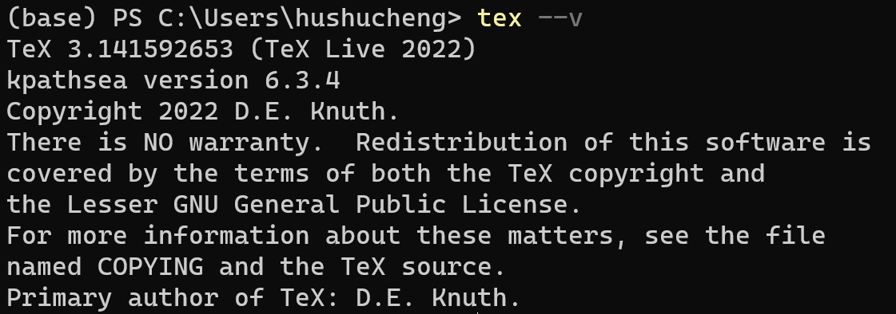
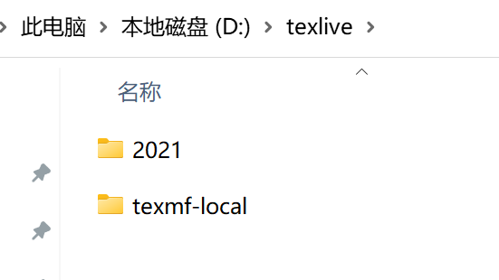
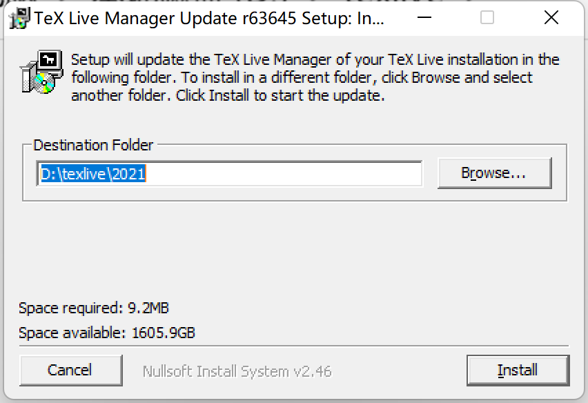
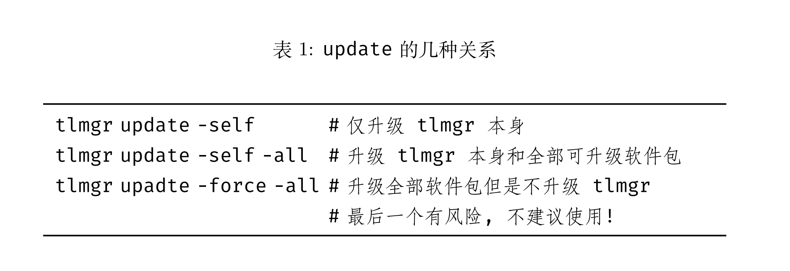
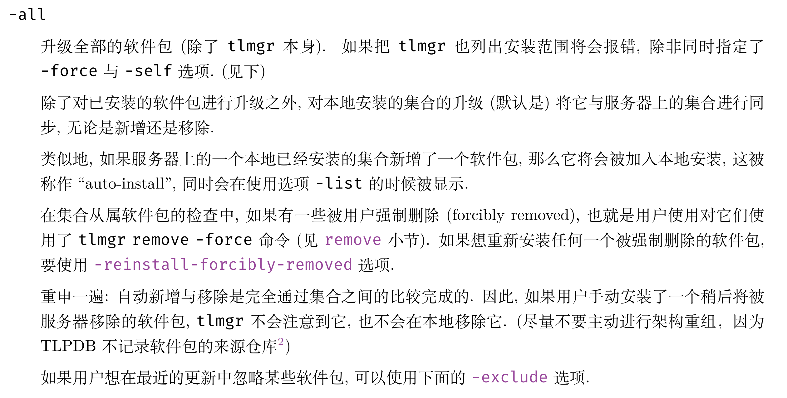

# 不卸载重装，直接升级TeX Live的方法（Win11）

## 前言

前两天想要用LaTeX写中文文档，更新ctex宏包的时候想起来已经好久没有更新TeX Live版本。

上网查了下，TeX Live的2022版本已经可以使用，觉得可以在写文档的空隙挂后台升级一下，但官方文档之中建议使用“新的安装”来获取TeX Live，没有给比较靠谱的官方升级方式。

于是在查阅了网上教程的基础上动手尝试，发现可以顺利通过升级TeX Live Manager来执行TeX Live的版本更新。

先给出版本更新结果



可以看到，已经是2022版本



虽然根目录处依旧显示的是2021

## 操作步骤

### 1.下载TeX Live Manager升级程序

到官方网站下载升级程序，链接[update-tlmgr-latest.exe](https://mirror.ctan.org/systems/texlive/tlnet/update-tlmgr-latest.exe)。

### 2.安装TeX Live Manager升级程序

升级程序会自动定位到TeX Live的安装目录，直接一路下一步安装即可。



### 3.命令行更新tlmgr以及其他宏包

设置让程序自动选择镜像源，这一步还是比较重要的，之前因为镜像设定的问题有几个宏包没有更新成功（更新失败解决方式见后粗体标注）

```
tlmgr option repository ctan
```

升级tlmgr本身

```
tlmgr update --self
```

升级其他宏包

```
tlmgr update --all
```

升级过程之中出现异常运行（**更新失败解决方式**）

```
tlmgr update --reinstall-forcibly-removed --all
```

### 4.顺利升级完成，检查版本输出结果

命令行查看版本

```
tex --v
```

## 部分指令解释

### 关于更新指令

使用文档之中以表格的形式给出了tlmgr update指令的解释



### 关于问题处理指令

使用文档之中all选项的解释如下



动手试了一下，如果不在异常出现之后使用--reinstall-forcibly-removed选项的话，这些升级失败的宏包就会被跳过。

### 为何要设定自动选取镜像源

之前按照网上的教程来发现指定某一镜像源进行升级的话会出现升级失败的问题，设定自动选择镜像源即可解决。

## 参考资料

使用文档：[关于 tlmgr 使用的简短的介绍. ❤️](https://github.com/syvshc/tlmgr-intro-zh-cn)

百度经验：[Windows系统跨版本升级TeXLive](https://jingyan.baidu.com/article/c33e3f48fed428ab14cbb568.html)

知乎回答：[TeXLive 2021 升级至 2022](https://zhuanlan.zhihu.com/p/531996454)